# Car Body Design & Aerodynamics

Projects from the course **Car Body Design and Aerodynamics** (MSc in Automotive Engineering,
Politecnico di Torino, A.Y. 2025/26): an external-aerodynamics CFD study of the Alfa Romeo MiTo in
STAR-CCM+, plus three car-body design projects covering packaging, battery-pack CAD and structural dynamics.

  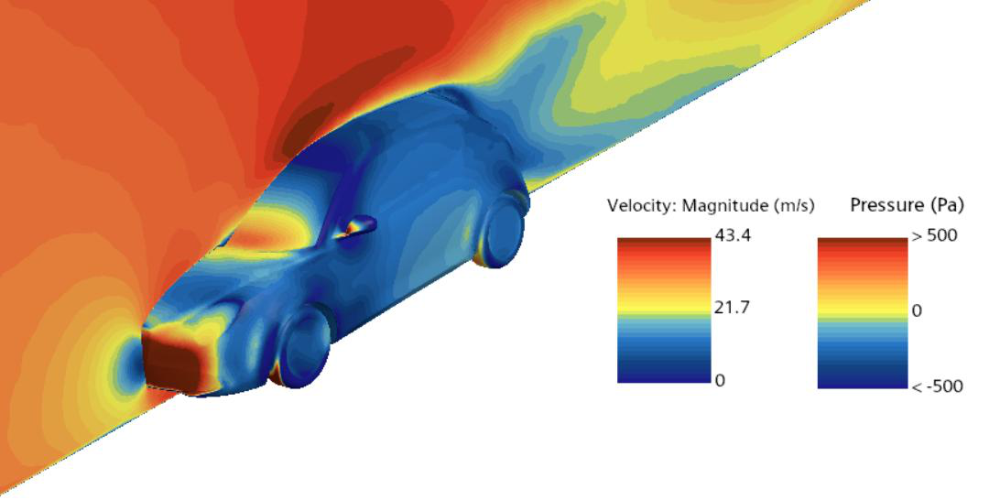

| Project | Topic | Tools | Material |
|---|---|---|---|
| [CFD: Alfa Romeo MiTo](#cfd--alfa-romeo-mito-external-aerodynamics) | Drag/lift prediction, effect of a front-wheel spat, validation against wind-tunnel data | STAR-CCM+ | [`Aero_Mito_report.pdf`](Aero_Mito_report.pdf), CSV data |
| [1: Wheel arches & ground clearance](#project-1--wheel-arch-and-ground-clearance-sizing) | Packaging of a BMW 3 Series under different load conditions | Analytical, CAD drawings | [`CBD_Report.pdf`](CBD_Report.pdf) (p. 1–16) |
| [2: Battery pack design](#project-2--battery-pack-design-byd-seal) | Cell-to-pack LFP battery for the BYD Seal, 3D model | SolidWorks | [`CBD_Report.pdf`](CBD_Report.pdf) (p. 17–29) |
| [3: Beam modal analysis](#project-3--fem-modal-analysis-of-a-cantilever-beam) | Timoshenko-beam FEM, modal analysis, FRF vs hammer test | MATLAB | [`Part3_main.m`](Part3_main.m), [`CBD_Report.pdf`](CBD_Report.pdf) (p. 30–46) |

---

## CFD — Alfa Romeo MiTo external aerodynamics

📄 [`Aero_Mito_report.pdf`](Aero_Mito_report.pdf) · 📊 [`Mito_nospats.csv`](Mito_nospats.csv), [`Mito_withspat.csv`](Mito_withspat.csv)

A steady RANS simulation (k–ε turbulence model) of a half-vehicle model in a virtual wind tunnel at
**140 km/h**, carried out in STAR-CCM+:

- **Mesh**: polyhedral, 25 mm base size, with custom refinements around the rear spoiler, diffuser,
  mirror and C-pillar.
- **Post-processing**: pressure and skin-friction coefficients, iso-pressure surfaces, streamlines,
  velocity planes and the drag build-up along the vehicle.
- **Design study**: effect of adding a **front-wheel spat**.

  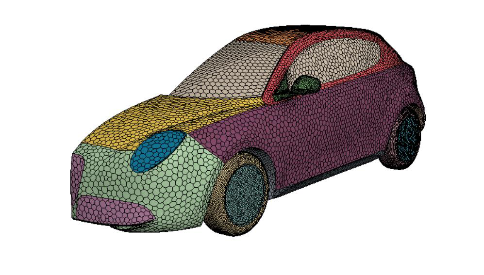

**Validation against the Stellantis climatic wind tunnel:**

| | CFD | Experimental |
|---|---|---|
| Cd | **0.292** | **0.290** |
| ΔCd due to the spat | −0.004 | −0.006 |
| Cl | −0.043 | 0.100 |

Drag and the drag change due to the spat are predicted accurately. Lift is not, which is a known
weakness of this kind of setup and is discussed in the report.

  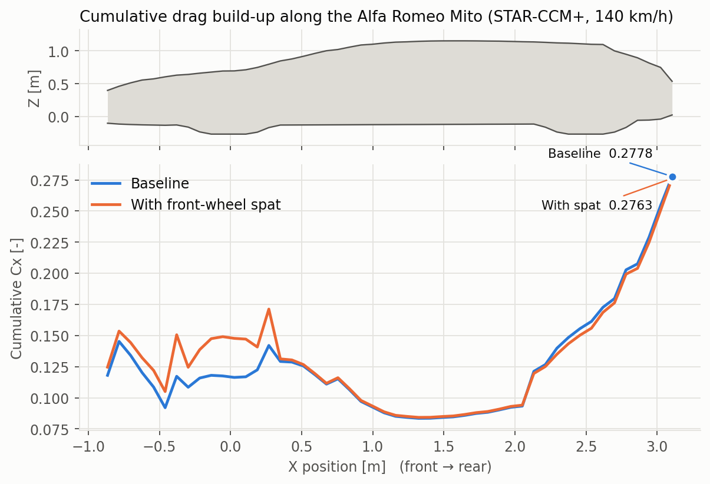

<em>Cumulative Cx along the vehicle (plotted from the CSV data). The spat adds
drag at the front wheel, then recovers more than that downstream by lowering the pressure on the front
and rear wheels.</em>

| | Baseline | With front-wheel spat |
|---|---|---|
| Pressure coefficient | 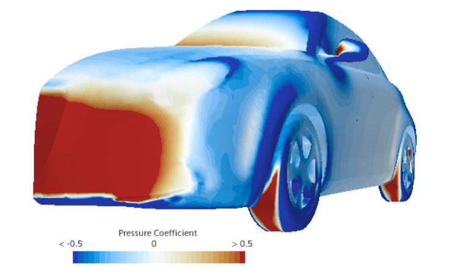 | 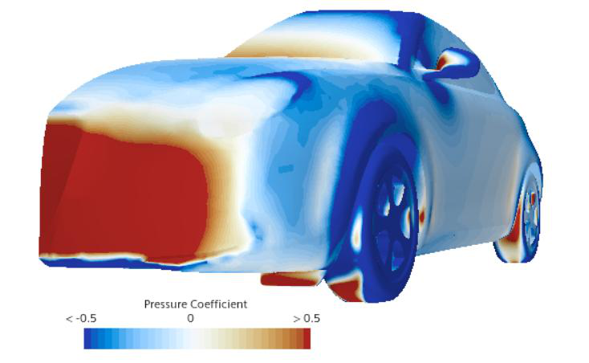 |
| Skin friction coefficient | 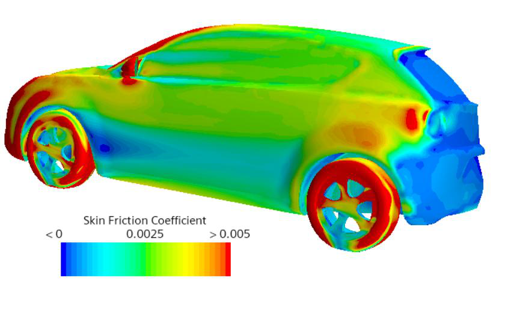 | 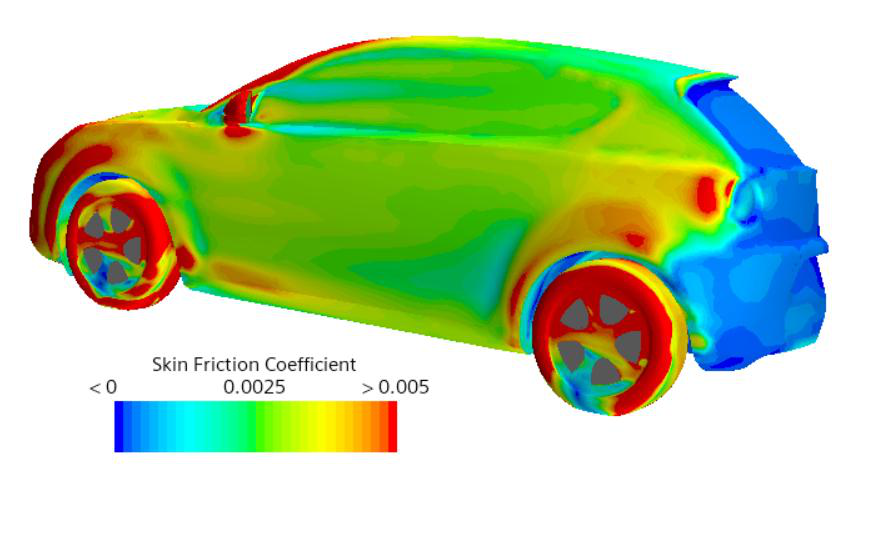 |
| Streamlines | 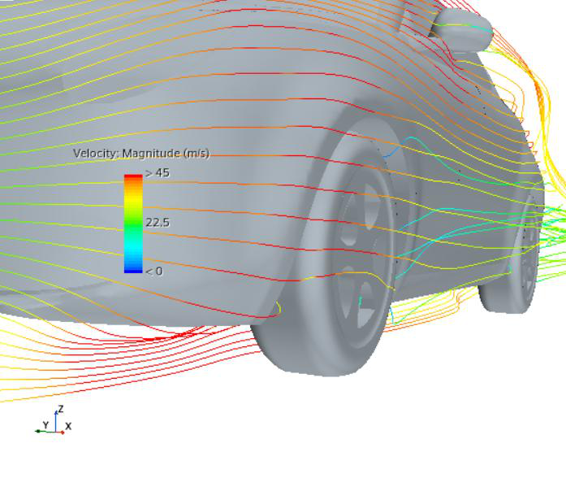 | 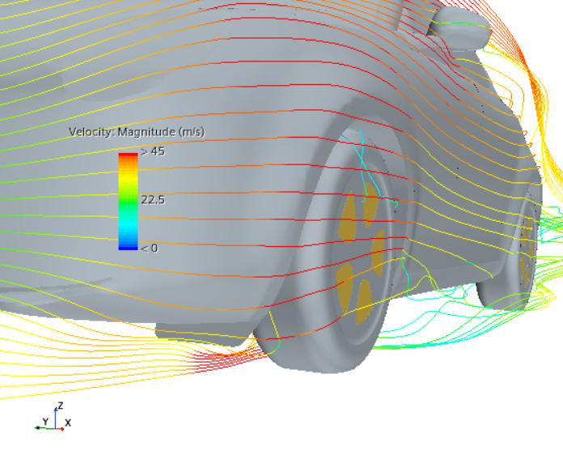 |

The spat deflects the flow away from the front wheel. The stagnation region on the tyre shrinks, and the
flow along the side stays attached longer: skin friction is higher and more uniform, and the streamlines
are more ordered.

> The `.sim` files are not included: about 270 MB each, and they need a STAR-CCM+ licence to open.

## Project 1 — Wheel arch and ground clearance sizing

📄 [`CBD_Report.pdf`](CBD_Report.pdf), pages 1–16

Packaging study of a **BMW 3 Series Sedan (2011)** (255/30 R19 tyres, rear-wheel drive):

- **Front wheel arch**: maximum steering angles from the kinematic steering geometry
  (δ1 = 29.9°, δ2 = 23.6°), plus clearance for suspension travel.
- **Rear wheel arch**: an additional 25 mm per side for snow chains and dirt layer.
- **Load cases**: six conditions (A–F), from an empty vehicle to five occupants plus luggage. For each,
  the axle loads, the axle vertical stiffness and the suspension deflections are computed (up to 31 mm
  front and 67 mm rear).
- **Ground clearance**: pitch angle 0.73° at full load, estimated ride height of about 150 mm.

  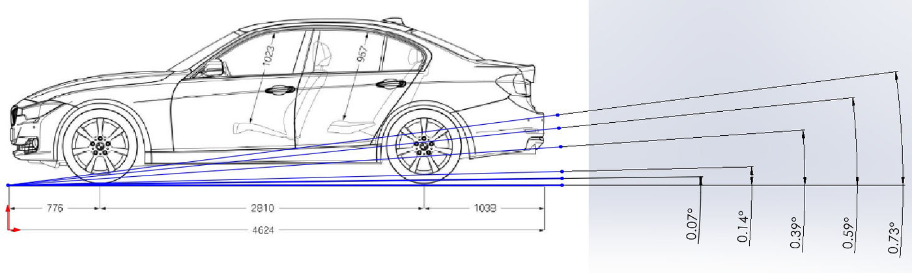

  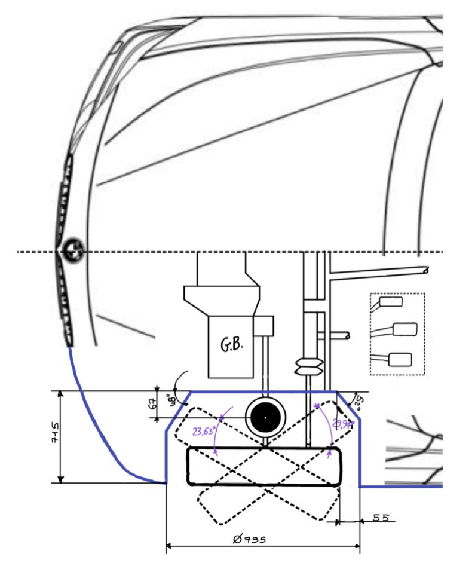
  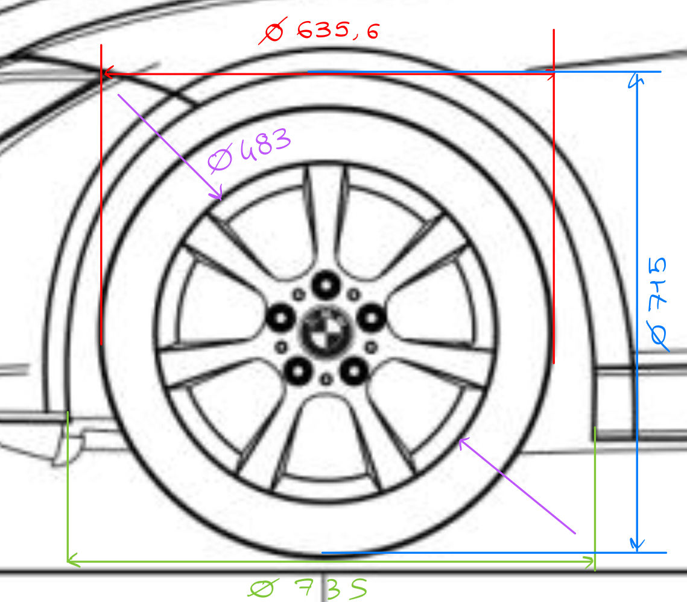
  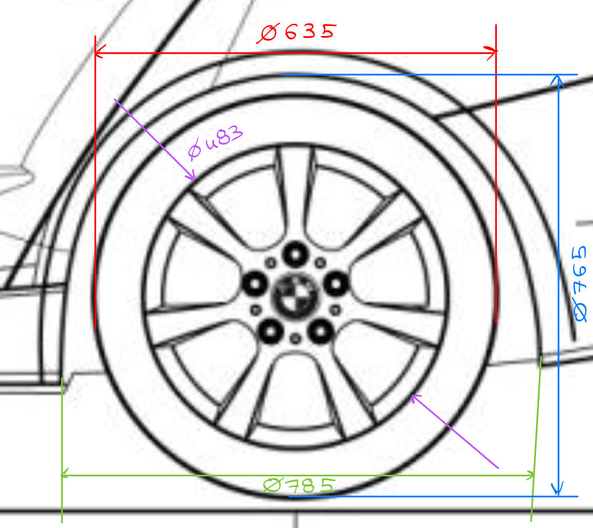

## Project 2 — Battery pack design (BYD Seal)

📄 [`CBD_Report.pdf`](CBD_Report.pdf), pages 17–29

Design of the **82.5 kWh, 550 V** battery pack of the BYD Seal Long Range:

- **Layout**: cell-to-pack with LFP Blade cells (3.2 V, 202 Ah), giving a **172S1P** configuration.
  Removing the modules makes up for the lower energy density of LFP cells.
- **Thermal management**: indirect liquid cooling through a serpentine cold plate above the cells,
  keeping the pack within 20–30 °C.
- **3D model** in **SolidWorks**: cells, bus bars, cold plate, covers and case, with materials assigned
  (Al 3003 and PEEK).
- **Check**: the CAD model reproduces the datasheet volumetric energy density within 0.6 % (329 vs
  330 Wh/L) and the volume utilisation efficiency within 0.2 % (96 %). The mass is overestimated by 18 %,
  because of simplified material assumptions.

  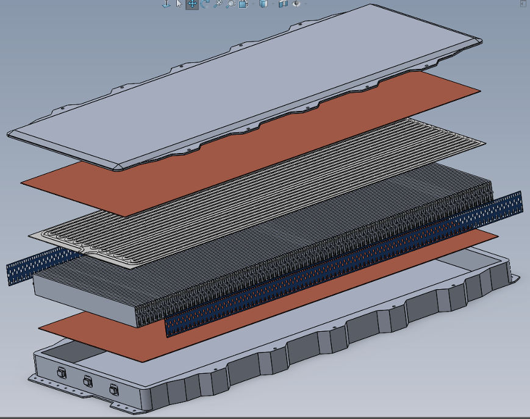
  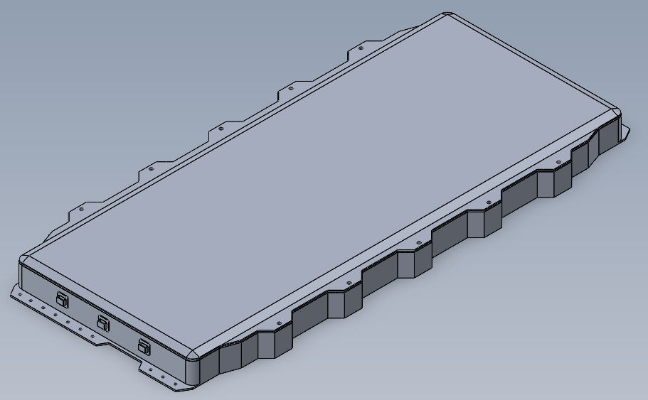

  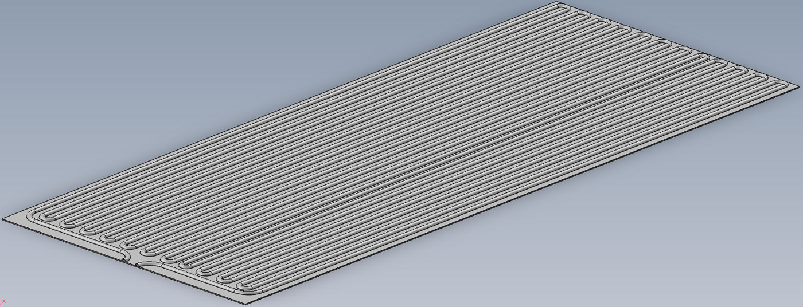

## Project 3 — FEM modal analysis of a cantilever beam

📄 [`CBD_Report.pdf`](CBD_Report.pdf), pages 30–46 · 💻 [`Part3_main.m`](Part3_main.m)

A FEM model of an aluminium cantilever beam (280 × 30 × 3 mm), compared with an experimental hammer test
(accelerometer and hammer 100 mm from the clamp):

- **Model**: 28 **Timoshenko** beam elements (shear deformation included), with consistent mass and
  stiffness matrices and the accelerometer mass added at its node.
- **Modal analysis**: eigenvalue problem → natural frequencies and mode shapes. Then modal damping
  (ζ = 0.019) and a state-space model of the FRF from hammer force to acceleration.
- **Calibration**: E and ζ are tuned on the experimental FRF. The first two resonances are matched at
  **29.7 Hz** and **158.6 Hz** (experimental: 159.4 Hz).

  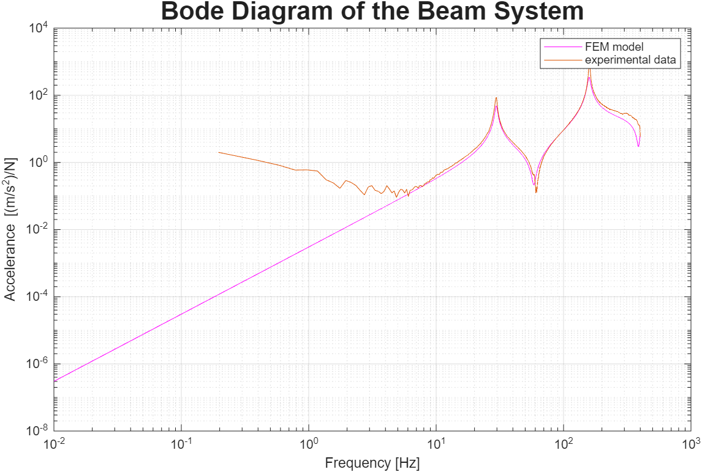

Mode shapes

  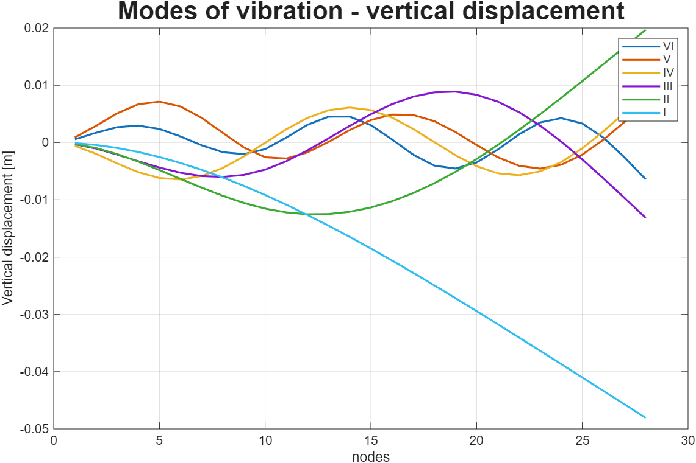
  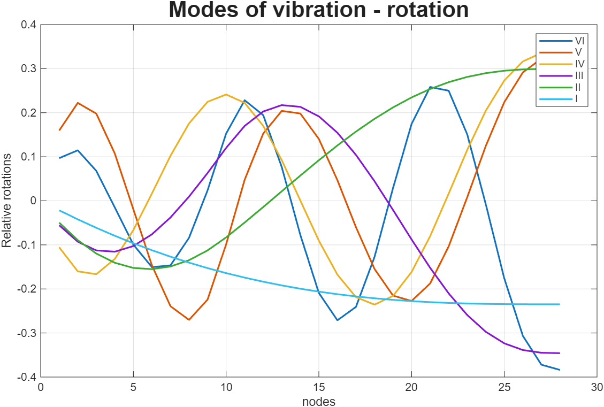

**Run:** open MATLAB in the repository folder and run `Part3_main.m` (it loads `Sq11_sn.mat`, the
measured FRF). It needs MATLAB with the Control System Toolbox.

---

## Authors

- **CFD: Alfa Romeo MiTo**: Dennis Bettinsoli
- **Projects 1–3**: Dennis Bettinsoli, Matteo Canestrini, Simone Massucco

The MiTo geometry, wind-tunnel reference data and experimental beam measurements were provided by the
course instructors of *Car Body Design and Aerodynamics*, Politecnico di Torino.
